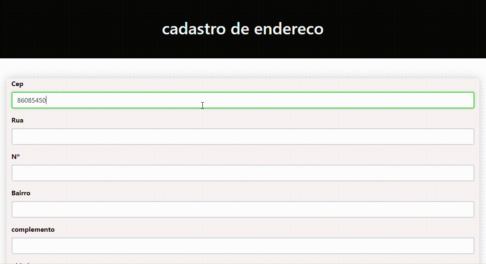

# CADASTRO DE ENDEREÇO
O objetivo deste trabalho é desenvolver um projeto funcional de Cadastro de Endereço, aplicando os conhecimentos adquiridos nas aulas. O projeto consistirá em um formulário que permite a coleta de dados de endereço, com a implementação de uma consulta à API dos Correios para validação do CEP. O trabalho será realizado em conjunto entre alunos e professor, e servirá como base para um projeto futuro mais complexo.


# O QUE FAZ ESSE CÓDIGO?
Este código JavaScript interage com a API do ViaCEP para buscar informações sobre um endereço a partir de um CEP (Código de Endereçamento Postal) digitado pelo usuário. Quando você digita um CEP válido e sai do campo, o código automaticamente busca as informações correspondentes (logradouro, bairro, cidade, estado) e preenche os campos de um formulário.

# COMO FUNCIONA?
* Validação do CEP: Verifica se o CEP digitado possui 8 dígitos numéricos.
* Consulta à API: Faz uma requisição à API do ViaCEP para obter os dados do endereço.

# PREENCHIMENTO DO FORMULARIO
Se os dados forem encontrados, preenche automaticamente os campos do formulário com as informações do endereço.

# TRATAMENTO DE ERROS
Exibe uma mensagem de alerta caso o CEP seja inválido ou não seja encontrado.

# COMO USAR O CÓDIGO:
* Incluir o código: Copie e cole este código JavaScript em um arquivo `.js` (por exemplo, `script.js`).
* Criar um formulário: Crie um formulário HTML com campos para o CEP, logradouro, bairro, cidade e estado.
* Vincular o script: Inclua o arquivo JavaScript no seu HTML usando a tag `<script>`:
   ```html
   <script src="script.js"></script>
   ```
* Associar o evento:
Associe o evento `focusout` ao campo do CEP para que a função de pesquisa seja chamada quando o usuário sair do campo.

# EXEMPLO DE HTML:
```html
<input type="text" id="cep" placeholder="Digite o CEP">
<input type="text" id="logradouro" disabled>
<input type="text" id="bairro" disabled>
<input type="text" id="localidade" disabled>
<input type="text" id="uf" disabled>
```
# OBSERVAÇÕES 
* API ViaCEP:
 Este código utiliza a API gratuita do ViaCEP ([https://viacep.com.br/](https://viacep.com.br/)).
* Personalização:
 Você pode personalizar o código para se adaptar às suas necessidades, como alterar os nomes dos elementos HTML ou adicionar mais funcionalidades.

